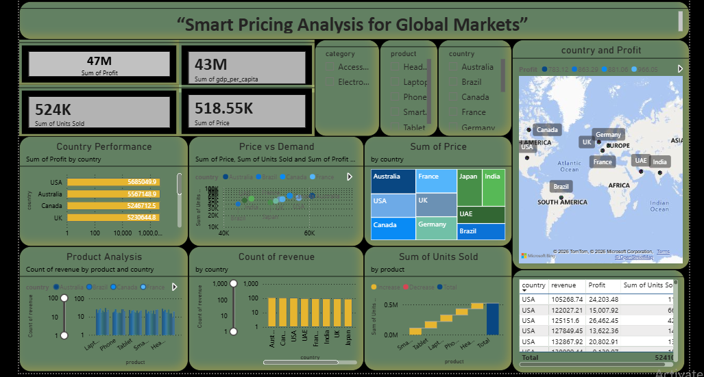

# Smart Pricing Analysis for Global Markets
## 📌 Project Overview

Smart Pricing Analysis for Global Markets is a Data Analytics project designed to analyze product pricing, sales performance, revenue, profitability, and economic factors across different global markets.

The project uses data cleaning, exploratory data analysis, SQL analysis, Python, and Power BI to generate meaningful business insights and support data-driven pricing decisions.

## 🎯 Project Objective

The main objectives of this project are:

- Analyze product and country-wise revenue
- Understand the relationship between price and units sold
- Analyze profit performance across markets
- Study the impact of GDP and population on sales
- Identify pricing and market trends
- Create an interactive Power BI dashboard
- Provide business recommendations based on data

## 🛠️ Tools & Technologies

- Excel
- Power Query
- SQL
- Python
- Pandas
- Matplotlib
- Jupyter Notebook
- Power BI

## 📊 Dataset

The dataset contains information related to:

- Country
- Product
- Category
- Price (USD)
- Units Sold
- Profit (USD)
- Exchange Rate
- GDP per Capita
- Population

## 🔄 Project Workflow

Raw Data  
↓  
Data Cleaning  
↓  
Data Transformation  
↓  
Exploratory Data Analysis  
↓  
SQL Analysis  
↓  
Python Analysis  
↓  
Power BI Dashboard  
↓  
Business Insights & Recommendations

## 📈 Dashboard

The Power BI dashboard provides an interactive view of:

- Revenue
- Profit
- Units Sold
- Country-wise performance
- Product-wise performance
- Pricing trends
- Market analysis

### Dashboard Preview

## 🔍 Key Analysis

### Country-wise Revenue Analysis
Analyzed revenue contribution across different countries to identify high-performing markets.

### Product-wise Revenue Analysis
Compared product performance to identify products generating higher revenue and profit.

### Price vs Units Sold
Analyzed whether product pricing has an impact on customer demand and sales volume.

### GDP vs Revenue
Studied the relationship between economic conditions and market revenue.

### Population vs Units Sold
Analyzed whether larger population markets generate higher sales volumes.

## 💡 Business Recommendations

- Optimize pricing based on market demand.
- Focus on high-performing countries.
- Identify products with strong sales and profit potential.
- Use economic indicators when entering new markets.
- Monitor price sensitivity across different markets.
- Develop market-specific pricing strategies.

## 📁 Project Files

| File | Description |
|---|---|
| `global_smart_pricing_1000_rows (1).csv` | Project dataset |
| `01 . spa EDA.ipynb` | Python EDA |
| `Project_Smart_Pricing_Analysis...sql` | SQL analysis |
| `Smart Pricing Analysis.docx.pbix` | Power BI dashboard |
| `Dashboard.png` | Dashboard preview |
| `ER Diagram.png` | Database relationship diagram |

## 👩‍💻 Author

**Priya**

Data Analyst | Excel | SQL | Python | Power BI
